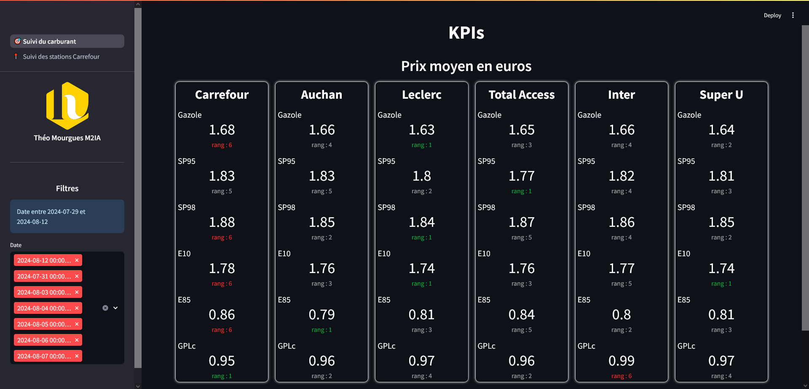
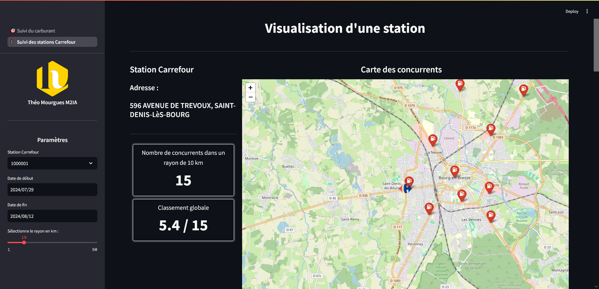
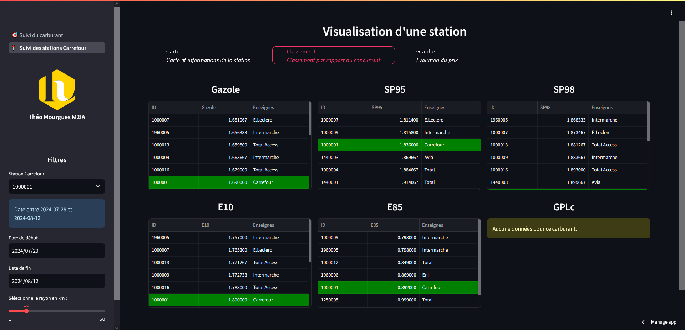
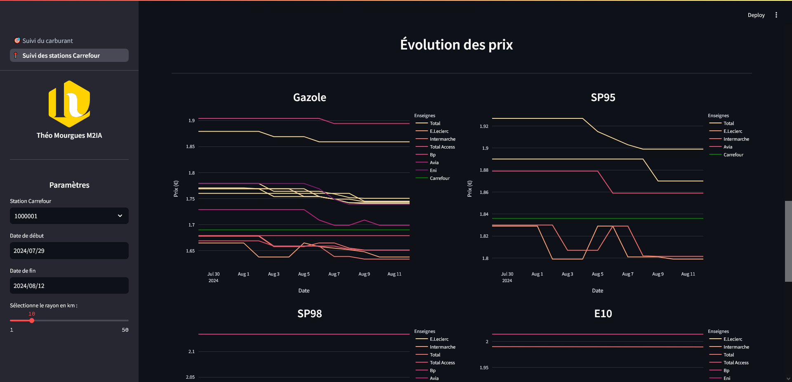

# Examen BI 2024
> Théo Mourgues - M2IA

## Arborescence
```bash
│   .gitignore
│   1_🎯_Suivi_du_carburant.py # Page des KPIs pour les enseignes
│   load_data.py # Script de chargement des données
│   readme.md 
│   requirements.txt # Dépendances
│
├───data
│       Carrefour.csv # Données des stations Carrefour
│       Concurrents.csv # Données des stations concurrentes
│       concurrents.json # Stations concurrentes pour chaque station Carrefour
│       data.csv # Données traitées
│       Infos_Stations.csv # Données originales des stations
│       Prix_2024_2semaines.csv # Données originales du prix des stations sur 2 semaines
│
├───images
│       carrefour.png # Image carrefour utiliser pour la carte
│
└───pages
        2_📍_Suivi_des_stations_Carrefour.py # Page de visualisation pour une station
```

## Installation
```bash
pip install -r requirements.txt
```

## Utilisation
```bash
streamlit run 1_🎯_Suivi_du_carburant.py
```
## Traitement des données 
Tout le traitement des données ce fait dans le fichier `load_data.py` qui va charger les données, les traiter et les sauvegarder. Il fait pas les traitements si les fichiers de données traitées existent déjà.

## Les pages :
### 1. Page des KPIs pour les enseignes
#### Filtres
- **Date de début** : Date de début de la période
- **Date de fin** : Date de fin de la période

#### Données

On affiche pour chaque enseigne et carburant le prix moyen et le classement par rapport aux autres enseignes. 1er veut dire le moins cher et 6ème le plus cher.




### 2. Page de visualisation pour une station
#### Filtres
- **Station** : Nom de la station
- **Date de début** : Date de début de la période
- **Date de fin** : Date de fin de la période
- **Rayon** : Rayon de recherche pour les stations concurrentes en km

#### Données
- **Carte des concurrents** : Affiche les stations concurrentes dans un rayon donné, la station est affiché avec l'icone Carrefour, les autres stations avec l'icone d'une station rouge et une popup affiche l'enseigne et l'addresse de la station.
- **Information de la station :**
    - Adresse de la station
    - Nombre de concurrent dans le rayon
    - Classement global de la station


Tableau du prix moyen sur la période sélectionner trier dans l'ordre croissant avec la station Carrefour en vert.


Graphique de l'évolution des prix sur la période sélectionner, les concurrents ont une couleur chaude et la station Carrefour en vert.



